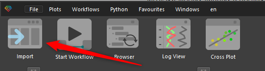

Загрузка любых данных в продукте начинается с кнопки загрузки данных, расположенной в верхней части ПО:

Также пользователь может просто перетащить нужный ему файл в [[Главное окно продукта]] из файлового менеджера.

![[Обзор процесса работы/ЗагрузкаТабличныхДанных_imgs/2023-08-11_08h54_58.gif]]

Гамма распознает тип файла и откроет подходящий тип загрузчика для этих данных. В данной статье мы рассмотриваем загрузку табличных данных из файлов XLS или XLSX.

В файлах табличного вида могут быть загружена почти любая информация, но чаще всего загружаются следующие данные:
+ данные геохронологии, [[стратиграфия]] и [[маркеры]]
+ [[керновые данные]], включая интерваля отбора, описания и прочее
+ [[инклинометрия]]
+ [[заголовки скважин]]

При загрузке Excel файлов откроется инструмент настройки содержимого следующего вида:

![[Обзор процесса работы/ЗагрузкаТабличныхДанных_imgs/Pasted image 20230811084832.png]]

Графически данный инструмент разделен на 2 части: верхняя показывает файл в его исходном виде, а нижняя - то представление, которое было распознано в соответствии с настройками при загрузке.

Далее пользователю необходимо убедиться, что файл загружается с нужной строки, а также, что строка заголовка данных и единиц измерения определены правильно. Данные настройки можно поменять нажав на кнопку **Import Settings**:

![[Обзор процесса работы/ЗагрузкаТабличныхДанных_imgs/Pasted image 20230811090119.png]]

При этом откроется соответствующее окно настроек:

![[Обзор процесса работы/ЗагрузкаТабличныхДанных_imgs/2023-08-11_09h01_46.png]]

Далее пользователю необходимо настроить типы загружаемых данных, т.е. определить какие из колонок определяют имя скважин, какие датасеты, где расположена глубина (или другой референс). Все колонки с данными для загрузки помечаются как **log**:

![[Обзор процесса работы/ЗагрузкаТабличныхДанных_imgs/2023-08-11_09h05_42.png]]

После того как все настройки завершены, для загрузки в БД Гаммы обозначенной информации, необходимо нажать **Apply**:

![[Обзор процесса работы/ЗагрузкаТабличныхДанных_imgs/2023-08-11_09h09_39.png]]

Перед загрузкой данных, пользователь может изменить как имена загружаемых кривых, так и их единицы измерения. Также это можно сделать и на следующем этапе в БД.

![[Обзор процесса работы/ЗагрузкаТабличныхДанных_imgs/2023-08-11_09h34_03.gif]]

Если в исходном файле будут находится данные по нескольким скважинам, то все данные будут загружены в соответствующие им скважины.

