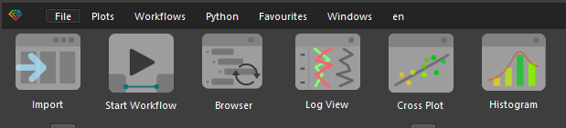
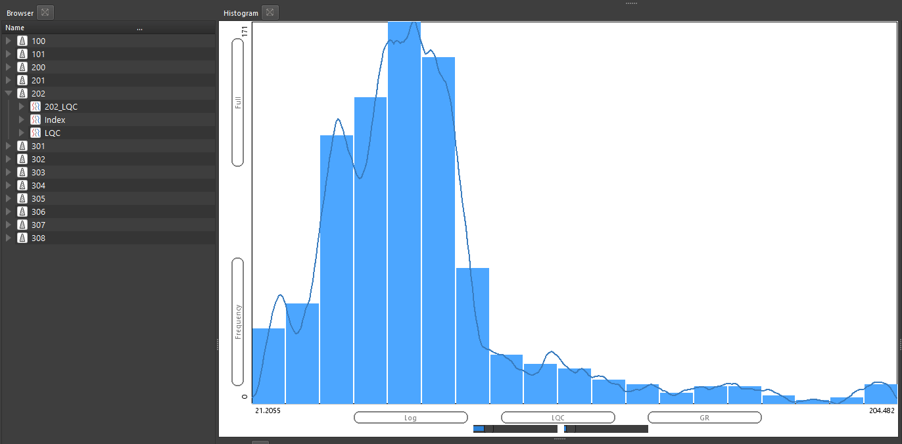

Инструмент Гистограмма доступен в верхней части панели продукта

При открытии данного инструмента, пользователь увидит следующее окно:

По умолчанию задано значение RHOB для отображения. Пользователь может перенести в поле с надписью RHOB любую другую кривую для ее отображения в качестве гистограммы. Для примера отобразим кривую GR (Гамма каротаж):

При этом будут отображены сразу блоковая и непрерывный тип гистограммы.

Далее пользователь может добавить еще данных, просто перенеся другие скважины в область гистограммы:

Далее можно настроить масштаб отображения:
+ изменить масштаб гистограмма (перенести ее визуально влево или вправо) можно при помощи удержания правой кнопки мыши
+ Для увеличения или уменьшения масштаба достаточно покрутить колесо мыши с зажатой клавишей CTLR
+ Также можно задать точные параметры отображения вручную, если просто вбить новые значения по осям

Пример:

Для отображения гистограммы по другим данным, когда скважины уже определены, необходимо изменить имя в фильтре данных. Для этого пользователю достаточно перенести требуемое имя на это поле:

Демонстрация на видео:

